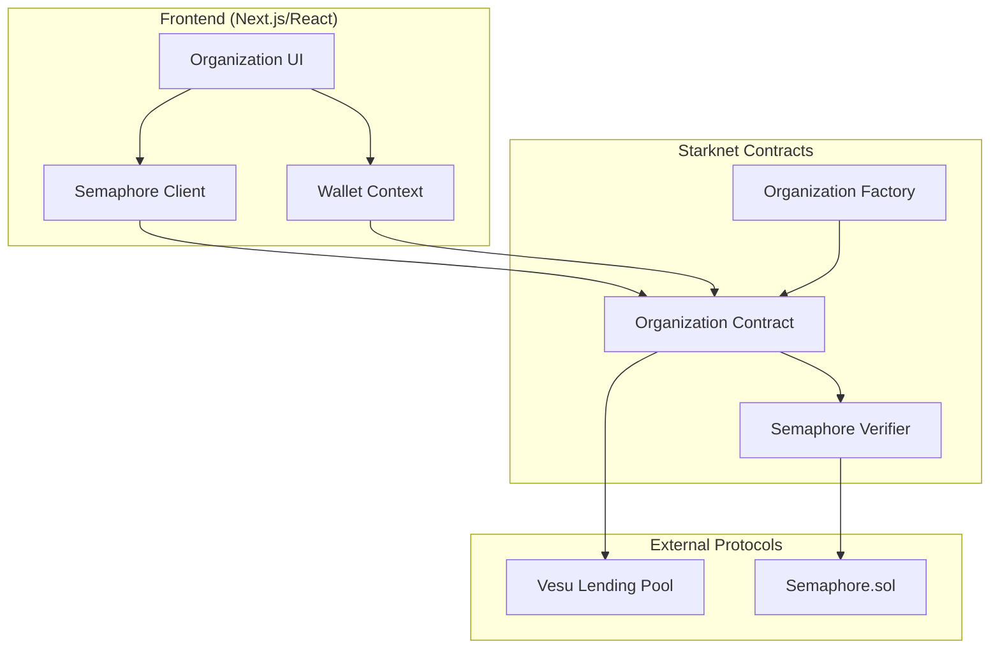

# Design Document

## Overview

This design implements privacy-preserving organization pooling using Semaphore Protocol for anonymous membership and voting, integrated with the existing Vesu lending infrastructure. Organizations are Starknet smart contracts that manage pooled wBTC collateral and coordinate anonymous borrowing decisions through zero-knowledge proofs.

The system consists of three main layers:
1. **Frontend Layer**: React components for organization management, proposal creation, and voting
2. **Smart Contract Layer**: Starknet contracts for organization state, Semaphore group management, and Vesu integration
3. **Privacy Layer**: Semaphore Protocol for anonymous identity commitments and zero-knowledge proof verification

## Architecture

### System Components



### Data Flow

**Organization Creation Flow:**
1. User clicks "Create Organization" → Frontend generates Semaphore group parameters
2. Frontend calls OrgFactory.createOrganization() → Deploys new OrgContract instance
3. OrgContract calls Semaphore.createGroup() → Registers group on-chain
4. OrgContract emits OrganizationCreated event → Frontend updates UI

**Anonymous Proposal Flow:**
1. Member generates Semaphore proof off-chain → Proves group membership without revealing identity
2. Member calls OrgContract.createProposal(proof, amount, purpose) → Verifies proof on-chain
3. OrgContract stores proposal with nullifier → Prevents duplicate proposals
4. OrgContract emits ProposalCreated event → Frontend displays proposal

**Anonymous Voting Flow:**
1. Member generates Semaphore proof with vote signal → Proves membership + vote choice
2. Member calls OrgContract.vote(proposalId, proof) → Verifies proof on-chain
3. OrgContract checks nullifier uniqueness → Prevents double-voting
4. OrgContract increments vote count → Updates proposal state
5. If quorum reached → Proposal becomes executable

**Borrow Execution Flow:**
1. Anyone calls OrgContract.executeProposal(proposalId) → Checks quorum + approval
2. OrgContract approves wBTC to Vesu → Grants spending permission
3. OrgContract calls Vesu.supply(wBTC, pooledAmount) → Deposits collateral
4. OrgContract calls Vesu.borrow(USDC, requestedAmount) → Borrows against collateral
5. OrgContract transfers USDC to proposal creator → Distributes borrowed funds

## Components and Interfaces

### Smart Contracts

#### OrganizationFactory.cairo

Factory contract for deploying organization instances.

```cairo
#[starknet::interface]
trait IOrganizationFactory<TContractState> {
    fn create_organization(
        ref self: TContractState,
        name: felt252,
        admin: ContractAddress,
        semaphore_address: ContractAddress
    ) -> ContractAddress;
    
    fn get_organization_count(self: @TContractState) -> u256;
    fn get_organization_by_index(self: @TContractState, index: u256) -> ContractAddress;
}

#[starknet::contract]
mod OrganizationFactory {
    use starknet::ContractAddress;
    use starknet::deploy_syscall;
    
    #[storage]
    struct Storage {
        organizations: LegacyMap<u256, ContractAddress>,
        organization_count: u256,
    }
    
    #[event]
    #[derive(Drop, starknet::Event)]
    enum Event {
        OrganizationCreated: OrganizationCreated,
    }
    
    #[derive(Drop, starknet::Event)]
    struct OrganizationCreated {
        organization: ContractAddress,
        admin: ContractAddress,
        group_id: u256,
    }
}
```

#### Organization.cairo

Main organization contract managing members, collateral, proposals, and Vesu integration.

```cairo
#[starknet::interface]
trait IOrganization<TContractState> {
    // Member management
    fn add_member(ref self: TContractState, identity_commitment: u256);
    fn get_member_count(self: @TContractState) -> u256;
    
    // Collateral management
    fn deposit_collateral(ref self: TContractState, amount: u256);
    fn withdraw_collateral(ref self: TContractState, amount: u256);
    fn get_total_collateral(self: @TContractState) -> u256;
    fn get_member_collateral(self: @TContractState, member: ContractAddress) -> u256;
    
    // Proposal management
    fn create_proposal(
        ref self: TContractState,
        proof: SemaphoreProof,
        amount: u256,
        purpose: felt252,
        duration: u64
    ) -> u256;
    fn vote(ref self: TContractState, proposal_id: u256, proof: SemaphoreProof, vote_yes: bool);
    fn execute_proposal(ref self: TContractState, proposal_id: u256);
    fn get_proposal(self: @TContractState, proposal_id: u256) -> Proposal;
    
    // Debt management
    fn repay_debt(ref self: TContractState, amount: u256);
    fn get_total_debt(self: @TContractState) -> u256;
    
    // Metrics
    fn get_ltv(self: @TContractState) -> u256;
    fn get_health_factor(self: @TContractState) -> u256;
}

#[derive(Drop, Serde, starknet::Store)]
struct Proposal {
    id: u256,
    creator_nullifier: u256,
    amount: u256,
    purpose: felt252,
    yes_votes: u256,
    no_votes: u256,
    executed: bool,
    created_at: u64,
    expires_at: u64,
}

#[derive(Drop, Serde)]
struct SemaphoreProof {
    merkle_tree_depth: u256,
    merkle_tree_root: u256,
    nullifier: u256,
    message: u256,
    scope: u256,
    points: Array<u256>, // Proof points for verification
}

#[starknet::contract]
mod Organization {
    use starknet::ContractAddress;
    use starknet::get_caller_address;
    use starknet::get_block_timestamp;
    
    #[storage]
    struct Storage {
        admin: ContractAddress,
        semaphore_address: ContractAddress,
        group_id: u256,
        vesu_pool: ContractAddress,
        wbtc_token: ContractAddress,
        usdc_token: ContractAddress,
        
        // Member tracking
        member_collateral: LegacyMap<ContractAddress, u256>,
        total_collateral: u256,
        
        // Proposal tracking
        proposals: LegacyMap<u256, Proposal>,
        proposal_count: u256,
        proposal_nullifiers: LegacyMap<u256, bool>, // Prevent duplicate proposals
        vote_nullifiers: LegacyMap<(u256, u256), bool>, // (proposal_id, nullifier) -> used
        
        // Debt tracking
        total_debt: u256,
    }
    
    #[event]
    #[derive(Drop, starknet::Event)]
    enum Event {
        MemberAdded: MemberAdded,
        CollateralDeposited: CollateralDeposited,
        CollateralWithdrawn: CollateralWithdrawn,
        ProposalCreated: ProposalCreated,
        VoteCast: VoteCast,
        ProposalExecuted: ProposalExecuted,
        DebtRepaid: DebtRepaid,
    }
    
    #[derive(Drop, starknet::Event)]
    struct MemberAdded {
        identity_commitment: u256,
    }
    
    #[derive(Drop, starknet::Event)]
    struct CollateralDeposited {
        member: ContractAddress,
        amount: u256,
        total_collateral: u256,
    }
    
    #[derive(Drop, starknet::Event)]
    struct CollateralWithdrawn {
        member: ContractAddress,
        amount: u256,
        total_collateral: u256,
    }
    
    #[derive(Drop, starknet::Event)]
    struct ProposalCreated {
        proposal_id: u256,
        nullifier: u256,
        amount: u256,
        purpose: felt252,
    }
    
    #[derive(Drop, starknet::Event)]
    struct VoteCast {
        proposal_id: u256,
        nullifier: u256,
        vote_yes: bool,
    }
    
    #[derive(Drop, starknet::Event)]
    struct ProposalExecuted {
        proposal_id: u256,
        amount_borrowed: u256,
    }
    
    #[derive(Drop, starknet::Event)]
    struct DebtRepaid {
        amount: u256,
        remaining_debt: u256,
    }
}
```

### Frontend Components

#### OrganizationsTab.tsx

Main tab component for organization management.

```typescript
interface OrganizationsTabProps {
  // Inherits wallet context from parent
}

export function OrganizationsTab() {
  const { address, isConnected } = useWallet()
  const { network } = useNetwork()
  const [view, setView] = useState<'list' | 'create' | 'detail'>('list')
  const [selectedOrg, setSelectedOrg] = useState<string | null>(null)
  
  return (
    <div className="space-y-6">
      {view === 'list' && <OrganizationList onSelect={setSelectedOrg} onCreate={() => setView('create')} />}
      {view === 'create' && <CreateOrganization onBack={() => setView('list')} />}
      {view === 'detail' && selectedOrg && <OrganizationDetail orgAddress={selectedOrg} onBack={() => setView('list')} />}
    </div>
  )
}
```

#### CreateOrganization.tsx

Component for creating new organizations.

```typescript
interface CreateOrganizationProps {
  onBack: () => void
}

export function CreateOrganization({ onBack }: CreateOrganizationProps) {
  const [name, setName] = useState('')
  const [isCreating, setIsCreating] = useState(false)
  const { createOrganization } = useOrganization()
  
  const handleCreate = async () => {
    setIsCreating(true)
    try {
      const orgAddress = await createOrganization(name)
      toast.success('Organization created!', {
        description: `Address: ${orgAddress}`,
      })
      onBack()
    } catch (err) {
      toast.error('Failed to create organization')
    } finally {
      setIsCreating(false)
    }
  }
  
  return (
    <Card>
      <CardHeader>
        <CardTitle>Create Organization</CardTitle>
        <CardDescription>
          Create a privacy-preserving organization for pooled borrowing
        </CardDescription>
      </CardHeader>
      <CardContent className="space-y-4">
        <div>
          <Label htmlFor="name">Organization Name</Label>
          <Input
            id="name"
            value={name}
            onChange={(e) => setName(e.target.value)}
            placeholder="My Lending DAO"
          />
        </div>
        <div className="flex gap-2">
          <Button onClick={onBack} variant="outline">Cancel</Button>
          <Button onClick={handleCreate} disabled={isCreating || !name}>
            {isCreating ? 'Creating...' : 'Create Organization'}
          </Button>
        </div>
      </CardContent>
    </Card>
  )
}
```

#### OrganizationDetail.tsx

Component for viewing and interacting with an organization.

```typescript
interface OrganizationDetailProps {
  orgAddress: string
  onBack: () => void
}

export function OrganizationDetail({ orgAddress, onBack }: OrganizationDetailProps) {
  const { organization, proposals, refreshOrganization } = useOrganizationData(orgAddress)
  const [activeTab, setActiveTab] = useState<'overview' | 'proposals' | 'members'>('overview')
  
  return (
    <div className="space-y-6">
      <Button onClick={onBack} variant="ghost">← Back to Organizations</Button>
      
      <Card>
        <CardHeader>
          <CardTitle>{organization?.name}</CardTitle>
          <CardDescription>Organization Address: {orgAddress}</CardDescription>
        </CardHeader>
        <CardContent>
          <Tabs value={activeTab} onValueChange={setActiveTab}>
            <TabsList>
              <TabsTrigger value="overview">Overview</TabsTrigger>
              <TabsTrigger value="proposals">Proposals</TabsTrigger>
              <TabsTrigger value="members">Members</TabsTrigger>
            </TabsList>
            
            <TabsContent value="overview">
              <OrganizationOverview organization={organization} />
            </TabsContent>
            
            <TabsContent value="proposals">
              <ProposalList proposals={proposals} orgAddress={orgAddress} />
            </TabsContent>
            
            <TabsContent value="members">
              <MemberManagement orgAddress={orgAddress} />
            </TabsContent>
          </Tabs>
        </CardContent>
      </Card>
    </div>
  )
}
```

### Hooks

#### useOrganization.ts

Hook for organization contract interactions.

```typescript
export function useOrganization() {
  const { account, address } = useWallet()
  const { network } = useNetwork()
  const [isLoading, setIsLoading] = useState(false)
  
  const createOrganization = async (name: string): Promise<string> => {
    if (!account) throw new Error('Wallet not connected')
    
    const config = getNetworkConfig(network)
    const factoryAddress = config.contracts.organizationFactory
    
    // Generate Semaphore group parameters
    const groupId = generateGroupId()
    
    // Call factory contract
    const result = await account.execute({
      contractAddress: factoryAddress,
      entrypoint: 'create_organization',
      calldata: [
        stringToFelt(name),
        address,
        config.contracts.semaphore,
      ],
    })
    
    // Extract organization address from event
    const orgAddress = await extractOrgAddressFromTx(result.transaction_hash)
    return orgAddress
  }
  
  const depositCollateral = async (
    orgAddress: string,
    amount: string
  ): Promise<string> => {
    if (!account) throw new Error('Wallet not connected')
    
    const config = getNetworkConfig(network)
    
    // Approve wBTC to organization
    await account.execute({
      contractAddress: config.contracts.wBTC,
      entrypoint: 'approve',
      calldata: [orgAddress, amount, '0'],
    })
    
    // Deposit collateral
    const result = await account.execute({
      contractAddress: orgAddress,
      entrypoint: 'deposit_collateral',
      calldata: [amount, '0'],
    })
    
    return result.transaction_hash
  }
  
  return {
    createOrganization,
    depositCollateral,
    isLoading,
  }
}
```

#### useSemaphore.ts

Hook for Semaphore identity and proof generation.

```typescript
import { Identity } from '@semaphore-protocol/identity'
import { Group } from '@semaphore-protocol/group'
import { generateProof, verifyProof } from '@semaphore-protocol/proof'

export function useSemaphore() {
  const [identity, setIdentity] = useState<Identity | null>(null)
  
  // Create or load identity from local storage
  useEffect(() => {
    const storedIdentity = localStorage.getItem('semaphore_identity')
    if (storedIdentity) {
      setIdentity(new Identity(storedIdentity))
    } else {
      const newIdentity = new Identity()
      localStorage.setItem('semaphore_identity', newIdentity.export())
      setIdentity(newIdentity)
    }
  }, [])
  
  const generateVoteProof = async (
    groupId: string,
    members: string[],
    proposalId: string,
    voteYes: boolean
  ): Promise<SemaphoreProof> => {
    if (!identity) throw new Error('Identity not initialized')
    
    // Create off-chain group
    const group = new Group(members)
    
    // Generate proof
    const message = voteYes ? '1' : '0'
    const scope = proposalId // Scope prevents double-voting on same proposal
    
    const proof = await generateProof(identity, group, message, scope)
    
    return {
      merkleTreeDepth: proof.merkleTreeDepth,
      merkleTreeRoot: proof.merkleTreeRoot,
      nullifier: proof.nullifier,
      message: proof.message,
      scope: proof.scope,
      points: proof.points,
    }
  }
  
  const generateProposalProof = async (
    groupId: string,
    members: string[],
    amount: string,
    purpose: string
  ): Promise<SemaphoreProof> => {
    if (!identity) throw new Error('Identity not initialized')
    
    const group = new Group(members)
    const message = hashProposalData(amount, purpose)
    const scope = groupId // Scope is group ID for proposals
    
    const proof = await generateProof(identity, group, message, scope)
    
    return {
      merkleTreeDepth: proof.merkleTreeDepth,
      merkleTreeRoot: proof.merkleTreeRoot,
      nullifier: proof.nullifier,
      message: proof.message,
      scope: proof.scope,
      points: proof.points,
    }
  }
  
  return {
    identity,
    identityCommitment: identity?.commitment.toString(),
    generateVoteProof,
    generateProposalProof,
  }
}
```

## Data Models

### Organization State

```typescript
interface Organization {
  address: string
  name: string
  admin: string
  groupId: string
  semaphoreAddress: string
  vesuPool: string
  
  // Collateral
  totalCollateral: bigint
  memberCollateral: Map<string, bigint>
  
  // Debt
  totalDebt: bigint
  
  // Metrics
  ltv: number
  healthFactor: number
  
  // Members
  memberCount: number
  members: string[] // Identity commitments
}
```

### Proposal State

```typescript
interface Proposal {
  id: string
  creatorNullifier: string
  amount: bigint
  purpose: string
  yesVotes: number
  noVotes: number
  executed: boolean
  createdAt: number
  expiresAt: number
  
  // Computed
  quorumReached: boolean
  approved: boolean
  expired: boolean
}
```

### Semaphore Proof

```typescript
interface SemaphoreProof {
  merkleTreeDepth: number
  merkleTreeRoot: string
  nullifier: string
  message: string
  scope: string
  points: string[] // ZK proof points
}
```

## Correctness Properties

*A property is a characteristic or behavior that should hold true across all valid executions of a system—essentially, a formal statement about what the system should do. Properties serve as the bridge between human-readable specifications and machine-verifiable correctness guarantees.*

### Property 1: Member Addition Preserves Group Integrity

*For any* organization and any valid identity commitment, adding a member should result in the Semaphore group containing that commitment and the member count increasing by one.

**Validates: Requirements 2.2, 2.3**

### Property 2: Collateral Deposit Round Trip

*For any* member and any deposit amount, depositing collateral then immediately checking the member's balance should return the deposited amount (assuming no prior balance).

**Validates: Requirements 3.1, 3.2, 3.3**

### Property 3: Nullifier Uniqueness for Proposals

*For any* organization and any Semaphore proof, attempting to create two proposals with the same nullifier should result in the second attempt being rejected.

**Validates: Requirements 4.5**

### Property 4: Nullifier Uniqueness for Votes

*For any* proposal and any Semaphore proof, attempting to vote twice with the same nullifier should result in the second vote being rejected.

**Validates: Requirements 5.2, 5.4**

### Property 5: Vote Count Accuracy

*For any* proposal, the sum of yes votes and no votes should equal the number of unique nullifiers recorded for that proposal.

**Validates: Requirements 5.3**

### Property 6: Quorum Calculation

*For any* proposal with total votes V and member count M, the proposal should be marked as reaching quorum if and only if V >= M/2 (simple majority).

**Validates: Requirements 6.1**

### Property 7: Collateral Withdrawal Safety

*For any* organization with total collateral C, total debt D, and withdrawal amount W, the withdrawal should be rejected if (C - W) / D < liquidation_threshold.

**Validates: Requirements 7.2**

### Property 8: Debt Repayment Reduces Total Debt

*For any* organization with debt D and repayment amount R, after repayment the total debt should equal max(0, D - R).

**Validates: Requirements 8.3**

### Property 9: LTV Calculation Consistency

*For any* organization with collateral C (in USD value) and debt D (in USD value), the LTV should equal (D / C) * 100.

**Validates: Requirements 9.3**

### Property 10: Vesu Integration Preserves Balances

*For any* organization borrowing amount B from Vesu, the organization's USDC balance should increase by B and the Vesu pool's debt record for the organization should increase by B.

**Validates: Requirements 6.3, 6.4**

## Error Handling

### Contract Errors

```cairo
mod Errors {
    const UNAUTHORIZED: felt252 = 'Caller not authorized';
    const INVALID_PROOF: felt252 = 'Invalid Semaphore proof';
    const DUPLICATE_NULLIFIER: felt252 = 'Nullifier already used';
    const INSUFFICIENT_COLLATERAL: felt252 = 'Insufficient collateral';
    const PROPOSAL_NOT_FOUND: felt252 = 'Proposal does not exist';
    const PROPOSAL_EXPIRED: felt252 = 'Proposal has expired';
    const PROPOSAL_NOT_APPROVED: felt252 = 'Proposal not approved';
    const PROPOSAL_ALREADY_EXECUTED: felt252 = 'Proposal already executed';
    const WITHDRAWAL_UNSAFE: felt252 = 'Withdrawal would violate LTV';
    const ZERO_AMOUNT: felt252 = 'Amount must be greater than zero';
}
```

### Frontend Error Handling

```typescript
export class OrganizationError extends Error {
  constructor(
    message: string,
    public code: string,
    public details?: any
  ) {
    super(message)
    this.name = 'OrganizationError'
  }
}

export function handleOrganizationError(error: any): string {
  if (error instanceof OrganizationError) {
    return error.message
  }
  
  if (error.message?.includes('UNAUTHORIZED')) {
    return 'You are not authorized to perform this action'
  }
  
  if (error.message?.includes('INVALID_PROOF')) {
    return 'Invalid Semaphore proof. Please try again.'
  }
  
  if (error.message?.includes('DUPLICATE_NULLIFIER')) {
    return 'You have already performed this action'
  }
  
  if (error.message?.includes('WITHDRAWAL_UNSAFE')) {
    return 'Withdrawal would put the organization at risk of liquidation'
  }
  
  return 'An unexpected error occurred. Please try again.'
}
```

## Testing Strategy

### Unit Tests

Unit tests verify specific examples and edge cases:

- **Contract Tests** (Cairo):
  - Test organization creation with valid parameters
  - Test member addition by admin
  - Test unauthorized member addition (should fail)
  - Test collateral deposit with zero amount (should fail)
  - Test proposal creation with invalid proof (should fail)
  - Test double-voting with same nullifier (should fail)
  - Test withdrawal that violates LTV (should fail)

- **Frontend Tests** (TypeScript/Jest):
  - Test Semaphore identity creation and storage
  - Test proof generation with valid group
  - Test UI state transitions (list → create → detail)
  - Test error message formatting

### Property-Based Tests

Property tests verify universal properties across all inputs using fast-check library (minimum 100 iterations per test):

- **Property 1 Test**: Generate random identity commitments, add to organization, verify group contains commitment
  - **Feature: semaphore-org-pooling, Property 1: Member Addition Preserves Group Integrity**

- **Property 2 Test**: Generate random deposit amounts, deposit then query balance, verify equality
  - **Feature: semaphore-org-pooling, Property 2: Collateral Deposit Round Trip**

- **Property 3 Test**: Generate random proof with nullifier, create proposal twice, verify second fails
  - **Feature: semaphore-org-pooling, Property 3: Nullifier Uniqueness for Proposals**

- **Property 4 Test**: Generate random vote proof, vote twice on same proposal, verify second fails
  - **Feature: semaphore-org-pooling, Property 4: Nullifier Uniqueness for Votes**

- **Property 5 Test**: Generate random votes, verify sum of yes/no equals unique nullifiers
  - **Feature: semaphore-org-pooling, Property 5: Vote Count Accuracy**

- **Property 6 Test**: Generate random vote counts and member counts, verify quorum calculation
  - **Feature: semaphore-org-pooling, Property 6: Quorum Calculation**

- **Property 7 Test**: Generate random collateral/debt/withdrawal amounts, verify safety check
  - **Feature: semaphore-org-pooling, Property 7: Collateral Withdrawal Safety**

- **Property 8 Test**: Generate random debt and repayment amounts, verify debt reduction
  - **Feature: semaphore-org-pooling, Property 8: Debt Repayment Reduces Total Debt**

- **Property 9 Test**: Generate random collateral and debt values, verify LTV calculation
  - **Feature: semaphore-org-pooling, Property 9: LTV Calculation Consistency**

- **Property 10 Test**: Generate random borrow amounts, execute borrow, verify balance changes
  - **Feature: semaphore-org-pooling, Property 10: Vesu Integration Preserves Balances**

### Integration Tests

- Test full flow: Create org → Add members → Deposit collateral → Create proposal → Vote → Execute → Borrow from Vesu
- Test Semaphore proof verification on-chain
- Test Vesu supply/borrow integration
- Test withdrawal with debt constraints

### Testing Framework

- **Cairo Tests**: Use Scarb test framework with `#[test]` annotations
- **TypeScript Tests**: Use Vitest with fast-check for property-based testing
- **Test Configuration**: Minimum 100 iterations per property test
- **Test Tagging**: Each property test includes comment with feature name and property number
